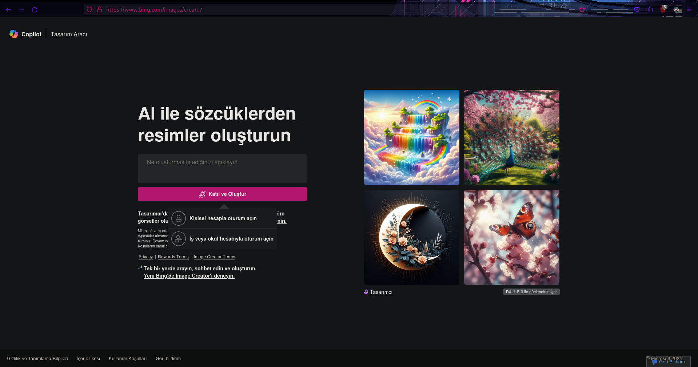
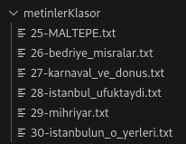
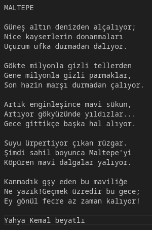

# Proje Ön izlemesi
https://www.youtube.com/watch?v=pWwOF7kNi4U

# Kullanmak için 
1. Sisteminizde Python ve Pip yüklü olduğuna emin olun.
2. Projeyi klonlayın ve proje klasörüne gidin.
3. python ile virtual environment oluşturun ve etkinleştirin.
	1. `python3 -m venv .venv`
	2. `source .venv/bin/activate`
4. virtual environment'a gerekli bağımlılıkları yükleyin
	1. `pip install selenium`
        2.  `pip install beautifulsoup4`
        3. `pip install pyotp`
        4. `pip install requests` 
5. "31. satırdaki" `librewolf_path = "/usr/bin/firefox"` alanına kullacağınız tarayıcının çalıştırılabilir program yolunu giriniz.
6. "51. satırdaki" `email_kutusu.send_keys("EMAIL")` bölümüne Bing sitesinde kullanacağınız mail adresinizi giriniz.
7. "61. satırdaki" `parola_kutusu.send_keys("PASSWORD")` mail adresinizin parolasını yazın.
8. Eğer hesabınızda TOTP ile 2 Faktörlü doğrulama sistemi kullanıyorsanız;
	1. "84. satırdaki" `totp_key = ""` çift tırnak içerisine anahtarınızı giriniz.
9. Hesabınızla ilk kez Bing'in sitesinde kullanıyorsanız bu projeyi çalıştırmadan önce siteye giderek "Kişisel hesapla oturum açın" seçeneğini seçin.
 
10. metinlerKlasor adındaki klasörün içerisine txt dosyalarınızı atın. 
	1. dosyaların SIRANUMARASI-DOSYAADI.txt şeklinde olması gereklidir. örnek: 
	2. 
	3. txt dosyalarının içinde büyük harflerle yazılmış bir başlık olmalıdır. Bu başlık resimler oluşturulduktan sonra başlık adı ile aynı olan klasörün içine kopyalanacaktır.
	4. 
11. "24. satırdaki" tarayıcının indirme yolunu kendi sisteminizin indirme yolu ile değiştirin.

```python
librewolf_options.set_preference("browser.download.dir", "/home/aziz/İndirilenler/selenium_fotolar")  # İndirme dizini
```

12. "24. satırdaki" yol ile "230. satıdaki" `source_directory` nin aynı olması gereklidir.
13. "231. satırdaki" `dest_directory` kendi sisteminize göre değiştirin.

```python
# Kaynak ve hedef dizinlerini belirle
source_directory = "/home/aziz/İndirilenler/selenium_fotolar"
dest_directory = "/home/aziz/Masaüstü/selenium_bing/sonuclar/"
```

14. projeyi çalıştırın.
	1. `python selenium_bing_imagecreator.py`
<hr>

# Hedefler

## 1. Daha açıklayıcı bir döküman hazırlamak
   1. İnsanlara projenin işlevini daha iyi tanıtılmalı.
   2. Projenin gelişimini sağlamak için kodların işlevleri daha iyi açıklanmalı.

## 2. Daha temiz bir kod
   1. Yine projenin başka insanlar tarafından rahatça geliştirilmesi için önemli.

## 3. Son kullanıcının rahatlığını düşünmek
   1. Github sayfasında README adımlarını okuduğunuzda görüceğiniz gibi projeyi başka insanların kendi sistemlerine uygulaması uzun bir süreç. Bu çok daha basitleştirilmeli.

## 4. Hata yönetimi
   1. Eğer metinlerKlasor adındaki klasörün içerisindeki txt dosyanız'ın içeriği İçerik politikası kurallarına takılırsa projeyi durdurmalı, txt dosyanızın metnini değiştirmeli yada direkt o dosyayı metinlerKlasor adındaki klasör'den çıkartmalı sonrasında kodu yeniden başlatmalısınız.


